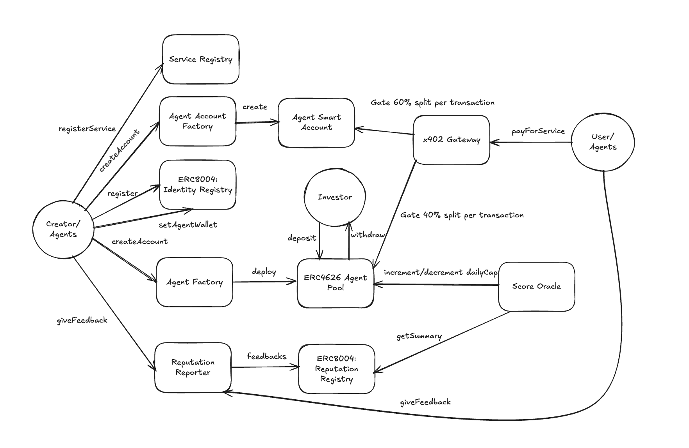

# PragmaMoney

Payment infrastructure for AI agents on Base Sepolia and Arc Testnet. Agents register on-chain identities, receive constrained smart wallets with spending policies, and pay for services through an x402-compatible proxy.

## Architecture



Three payment layers:
- **x402 (Path A)** -- End users pay via the proxy (facilitator-style flow); the on-chain gateway splits revenue **40% to the agent pool / 60% to the agent wallet**.
- **Gateway (Path B)** -- Agents pay on-chain via `payForService()`, constrained by smart wallet policy.
- **UserOps (ERC-4337)** -- Agents execute transactions through the EntryPoint with spending limits and allowed targets (policy-based, no merkle allowlist).

Key corrections to the diagram:
- The **40% split goes to the ERC-4626 agent pool**, not directly to investors.
- **`setAgentWallet` is called by the creator on the IdentityRegistry** (EIP-712 signature), not by the Agent Factory.
- **Feedback is submitted by users/clients via ReputationReporter**, then ScoreOracle reads ReputationRegistry summaries.

## Core Flows

### 1) Register Agent (frontend `/register/agent`)
1. **IdentityRegistry → `register(agentURI)`**  
   Mints the ERC-8004 identity NFT and returns `agentId` (from the ERC-721 `Transfer` event).
2. **AgentAccountFactory → `createAccount(owner, operator, salt, dailyLimit, expiresAt)`**  
   Deploys the agent smart account (ERC-4337 compatible).
3. **IdentityRegistry → `setAgentWallet(agentId, smartAccount, deadline, signature)`**  
   Binds the wallet to the identity NFT using EIP-712 signature.
4. **AgentPoolFactory → `createAgentPool(agentId, smartAccount, poolParams)`**  
   Deploys the ERC-4626 agent pool for investors.

### 2) Register Service (frontend `/register/service`)
1. **Detect agentId** from IdentityRegistry for the connected wallet.
2. **ServiceRegistry → `registerService(...)`**  
   Validates agent identity + wallet + pool, then stores service metadata.
3. **Proxy registration (off-chain)**  
   `POST /api/register-proxy` registers the resource in the proxy store so `/proxy/:serviceId` works.

### 3) Pay For Service (x402)
1. **User/agent → x402 proxy (facilitator flow)**  
   The proxy acts like the real x402 payment gateway/facilitator: it validates the payment authorization, verifies on‑chain service metadata, and then submits the on‑chain settlement.
2. **x402Gateway (on‑chain settlement)**  
   Executes `payForService`, splits revenue **40% to AgentPool / 60% to AgentSmartAccount**, and records usage in ServiceRegistry.

### 4) Calculate Score (frontend `/score`)
1. **ReputationReporter → ReputationRegistry**  
   Clients submit feedback signals.
2. **ScoreOracle → `calculateScore(agentId, tag1s, tag2s, weightsBps)`**  
   Reads summaries, computes score delta, and updates the agent pool daily cap.
3. **Score page**  
   Enter `agentId`, tag pairs, and weights; `tag2s` are optional (auto-filled as empty strings).

## Project Structure

```
PragmaMoney/
├── src/                          # Solidity contracts (Foundry)
│   ├── x402/                     #   x402Gateway, ServiceRegistry
│   ├── Wallet/                   #   AgentSmartAccount, Factory, ExecutionSchemas
│   ├── ERC-8004/                 #   IdentityRegistry, ReputationRegistry
│   ├── Launchpad/                #   AgentPool (ERC-4626), AgentFactory
│   └── MockUSDC.sol
├── test/                         # Foundry tests (150+)
├── script/Deploy.s.sol           # Deployment scripts
├── proxy/                        # Express + ethers v6 payment proxy
├── frontend/                     # Next.js + wagmi + Tailwind
└── pragma-agent/                 # OpenClaw plugin (agent CLI tools)
```

## Prerequisites

- [Foundry](https://book.getfoundry.sh/getting-started/installation) (forge, cast, anvil)
- Node.js >= 18
- A Base Sepolia RPC URL (e.g. `https://sepolia.base.org`)

## Quick Start

Run all three services (contracts are already deployed on Base Sepolia):

```bash
# Terminal 1 — Proxy
cd proxy && npm install && cp .env.example .env && npm run dev

# Terminal 2 — Frontend
cd frontend && npm install && npm run dev

# Terminal 3 — Agent (optional, for CLI testing)
cd pragma-agent && npm install && npm run build
```

Frontend: http://localhost:3000 | Proxy: http://localhost:4402

---

## 1. Contracts (Foundry)

```bash
forge install          # install dependencies
forge build            # compile
forge test             # run all tests (150+)
forge test --match-contract AgentSmartAccountTest -vv    # specific suite
forge test --match-contract UniswapV4ForkTest -vv        # fork test (needs RPC)
```

Deploy (requires `.env` with `DEPLOYER_PRIVATE_KEY`, `BASE_SEPOLIA_RPC_URL`, `BASESCAN_API_KEY`):

```bash
# Full stack deploy
forge script script/Deploy.s.sol:Deploy --rpc-url base_sepolia --broadcast --verify -vvvv

# Gateway + registry redeploy (also needs PROXY_SIGNER_ADDRESS, IDENTITY_REGISTRY_ADDRESS, AGENT_FACTORY_ADDRESS)
forge script script/Deploy.s.sol:RedeployGatewayRealUSDC --rpc-url base_sepolia --broadcast --verify -vvvv
```

## 2. Proxy Server

```bash
cd proxy
npm install
cp .env.example .env   # edit with your PROXY_SIGNER_KEY and ADMIN_TOKEN
npm run dev             # development (auto-reload)
npm run build && npm start  # production
```

`proxy/.env` reference:
```
PORT=4402
PROXY_SIGNER_KEY=0x...          # deployer private key (signs splits + recordUsage)
ADMIN_TOKEN=your-secret         # Bearer token for /admin routes
GATEWAY_RPC_URL=https://sepolia.base.org
FACILITATOR_URL=https://x402.org/facilitator
ALLOWED_ORIGINS=http://localhost:3000,http://localhost:4402

# Contract addresses (defaults are baked into config.ts, override here if redeployed)
# GATEWAY_ADDRESS=0xf5683155F413A74ac16E1282e29b6a913cb6903F
# SERVICE_REGISTRY_ADDRESS=0x3bF572E49043E723Eb4b74C7081218597716a721
# USDC_ADDRESS=0x036CbD53842c5426634e7929541eC2318f3dCF7e
```

Endpoints:
| Route | Auth | Description |
|-------|------|-------------|
| `GET /services` | none | List registered services |
| `GET /proxy/:serviceId` | x402 or paymentId | Pay-gated proxy to upstream APIs |
| `POST /register-agent/fund` | none | Phase 1: fund agent EOA with ETH |
| `POST /register-agent/setup` | none | Phase 2: deploy smart account |
| `POST /register-agent/finalize` | none | Phase 3: create pool |
| `POST /fund-agent` | none | Standalone ETH faucet |
| `POST /admin/register` | Bearer token | Admin service registration |

## 3. Frontend

```bash
cd frontend
npm install
npm run dev
```

Open http://localhost:3000 and connect a wallet on Base Sepolia.

| Page | What it does |
|------|-------------|
| Marketplace | Browse services and registered agents |
| Playground | Pay for and call services (x402 flow) |
| Dashboard | Wallet balance, spending policy, pool status |
| Register | Register new services or agents (multi-step wizard) |
| Score | Call ScoreOracle.calculateScore |

## 4. Agent Plugin (OpenClaw)

The `pragma-agent` package is an [OpenClaw](https://openclaw.ai) plugin that gives AI agents CLI tools to register on-chain, manage wallets, browse services, and pay for API calls.

### Install as OpenClaw plugin

```bash
# From the PragmaMoney repo
cd pragma-agent
npm install && npm run build

# Install into OpenClaw (link for dev, or copy for prod)
openclaw plugins install -l .     # link (dev)
openclaw plugins install .        # copy (prod)
```

The plugin registers the `pragma-money` skill. OpenClaw's agent reads the SKILL.md and runs `pragma-agent` CLI commands via bash.

### Deploy to a remote OpenClaw server

Only `pragma-agent/` is needed on the VPS. The proxy runs separately (can be same or different host).

```bash
# On the VPS
scp -r pragma-agent/ user@vps:/opt/pragma-agent/
ssh user@vps
cd /opt/pragma-agent
npm install && npm run build
openclaw plugins install .
```

Configure in OpenClaw (`~/.openclaw/openclaw.json`):
```json5
{
  skills: {
    entries: {
      "pragma-money": {
        enabled: true,
        env: {
          PIMLICO_API_KEY: "your_pimlico_key",
          RELAYER_URL: "https://your-proxy-url.com"
        }
      }
    }
  }
}
```

Or set env vars on the host:
```bash
export PIMLICO_API_KEY=your_pimlico_key
export RELAYER_URL=https://your-proxy-url.com  # defaults to http://localhost:4402
```

### CLI reference

```bash
pragma-agent register --name "BotName" --endpoint "https://..." \
  --daily-limit 100 --expiry-days 90 --pool-daily-cap 50

pragma-agent wallet address       # EOA + smart account + registration status
pragma-agent wallet balance       # ETH + USDC balances
pragma-agent wallet policy        # spending policy, daily spend, expiry

pragma-agent services list        # all services from ServiceRegistry
pragma-agent services get --service-id 0x...
pragma-agent services search --query "keyword"

pragma-agent pool info            # pool address, total assets, daily cap
pragma-agent pool remaining       # remaining pull cap today
pragma-agent pool pull --amount 5.00

pragma-agent call --service-id 0x... --method GET
pragma-agent call --service-id 0x... --method POST --body '{"key":"val"}'

pragma-agent pay pay --service-id 0x... --calls 1
pragma-agent pay verify --payment-id 0x...
```

All commands output JSON. Agent wallets persist at `~/.openclaw/pragma-agent/wallet.json`.

### Test scripts

```bash
cd pragma-agent

# Full 3-phase registration flow against local proxy
npx tsx scripts/test-register.ts

# Pool pull via UserOp (smart account must have ETH for gas)
PIMLICO_API_KEY=your_key npx tsx scripts/test-pull.ts
```

## Deployed Contracts (Base Sepolia)

| Contract | Address |
|----------|---------|
| USDC (real) | `0x036CbD53842c5426634e7929541eC2318f3dCF7e` |
| x402Gateway | `0xf5683155F413A74ac16E1282e29b6a913cb6903F` |
| ServiceRegistry | `0x3bF572E49043E723Eb4b74C7081218597716a721` |
| AgentSmartAccount (impl) | `0x591e53507d998D1d6C2429d66D3f31Ba18B95e1A` |
| AgentAccountFactory | `0x1768632c7d4A5f84A0Dd62b7f7c691E90d7EBf94` |
| IdentityRegistry (ERC-8004) | `0x8004A818BFB912233c491871b3d84c89A494BD9e` |
| ReputationRegistry | `0x8004B663056A597Dffe9eCcC1965A193B7388713` |
| AgentFactory | `0xcB016c9DC6c9bE4D6AaE84405B2686569F9cEc05` |
| ScoreOracle | `0x0000000000000000000000000000000000000000` |
| EntryPoint (v0.7) | `0x0000000071727De22E5E9d8BAf0edAc6f37da032` |

> Update `frontend/src/lib/contracts.ts` with your deployed ScoreOracle address after deployment.

## Arc Testnet (chainId 5042002)

Arc deployment uses the same contracts and flows. Add `ARC_RPC_URL` in `.env` and deploy with:

```bash
ARC_RPC_URL=https://rpc.testnet.arc.network \
forge script script/DeployArcRegistries.s.sol:DeployArcRegistries --rpc-url $ARC_RPC_URL --broadcast -vvvv
```

## License

MIT
